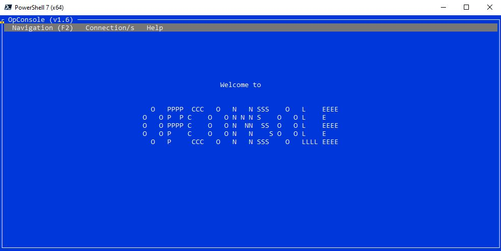
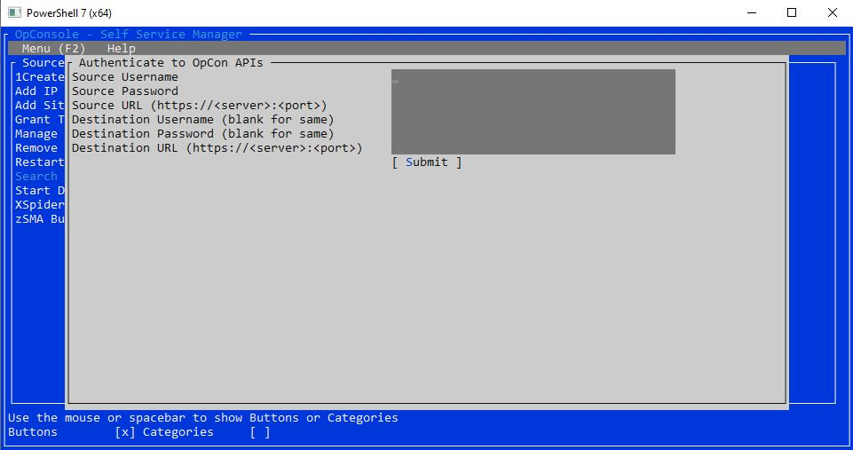
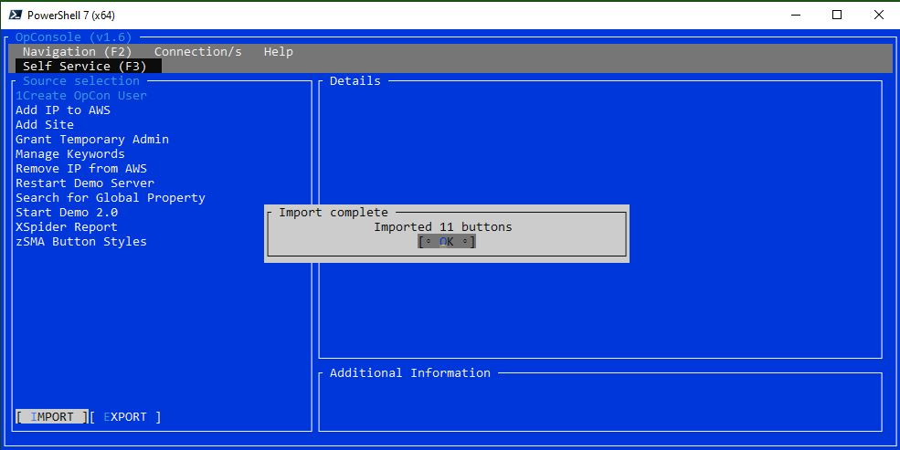

# OpConsole Self Service Manager
This terminal program is designed to help move manage OpCon environments from a command line.



# Prerequisites
* <a href="https://github.com/PowerShell/PowerShell/releases">Powershell 7+</a>
* Powershell Module - Microsoft.PowerShell.ConsoleGuiTools 
* <a href="https://github.com/SMATechnologies/opcon-rest-api-client-powershell">OpCon Powershell Module</a>
* OpCon environments on Release 17+
* OpCon license with access to OpCon API

# Instructions
To install the Microsoft.PowerShell.ConsoleGuiTools modules do the following:
```
Install-Module Microsoft.PowerShell.ConsoleGuiTools 
```

Run the program in OpCon or from a command line like this:
```
pwsh OpConsole.ps1 -cli -OpConModule "C:\OpConModule.psm1" -srcToken "1234" -srcURL "https://<server>:<port>" -destToken "5678" -destURL "https://<server>:<port>" -button "My Button"
```

Launch the terminal gui like this:
```
pwsh OpConsole.ps1 -OpConModule "C:\OpConModule.psm1"
```

Once launched, go to the Connection/s -> Select Environment area to select an environment to authenticate too or to add a new one.


After authenticating select Navigation -> Manage Self Service.  Choose an option from the Self Service menu, select Buttons or Categories to display the items in your active environment (that your role has access too):


You can then select the "SUBMIT" option to copy the button or category of buttons to the destination OpCon environment!  The role for the button will default to "ocadm" but any existing categories will carry over if they exist in the destination OpCon environment (if the category does not exist in the destination environment, it will be set to none).

# Disclaimer
No Support and No Warranty are provided by SMA Technologies for this project and related material. The use of this project's files is on your own risk.

SMA Technologies assumes no liability for damage caused by the usage of any of the files offered here via this Github repository.

# License
Copyright 2019 SMA Technologies

Licensed under the Apache License, Version 2.0 (the "License");
you may not use this file except in compliance with the License.
You may obtain a copy of the License at [apache.org/licenses/LICENSE-2.0](http://www.apache.org/licenses/LICENSE-2.0)

Unless required by applicable law or agreed to in writing, software
distributed under the License is distributed on an "AS IS" BASIS,
WITHOUT WARRANTIES OR CONDITIONS OF ANY KIND, either express or implied.
See the License for the specific language governing permissions and
limitations under the License.

# Contributing
We love contributions, please read our [Contribution Guide](CONTRIBUTING.md) to get started!

# Code of Conduct
[](code-of-conduct.md)
SMA Technologies has adopted the [Contributor Covenant](CODE_OF_CONDUCT.md) as its Code of Conduct, and we expect project participants to adhere to it. Please read the [full text](CODE_OF_CONDUCT.md) so that you can understand what actions will and will not be tolerated.
